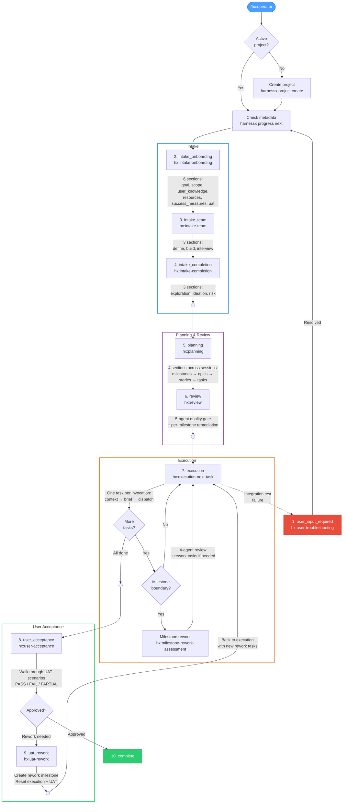

# The harnessx Process: End-to-End

This document walks through the complete harnessx lifecycle — from the moment a user first invokes the system through project completion. It covers every stage, every skill, and every transition.

---

## How It All Fits Together

harnessx has two layers that work in tandem:

1. **The CLI** (`harnessx` binary) — a stateless Rust tool that reads and writes JSON files. It tracks projects, pipeline progress, intake section status, and action items. Every command returns JSON in a standard envelope: `{ "success": true, "data": { ... } }`.

2. **The skills** (`.claude/skills/`) — markdown instruction files that teach Claude how to do specific work. Skills run in the main conversation, talk directly to the user, and call the CLI to read and update state.

The operator skill ties everything together. It checks where the user is in their project, calls the CLI for the current state, and invokes the right skill to continue.

---

## Phase 1: Entry and Project Creation

### Trigger

The user runs `/hx:operator`. This is always the entry point.

### What Happens

The operator skill runs `harnessx project active` to check if a project exists.

**If no active project:**

1. The operator asks the user for a brief project description.
2. It distills the description into a 2-3 word kebab-case ID (e.g., `trading-bot`, `auth-service`).
3. It creates the project: `harnessx project create <id>`.
4. This scaffolds the full project directory:
   ```
   harnessx/<id>/
   ├── progress.json              # 10 pipeline stages (all not_started except user_input_required = completed)
   └── intake/
       ├── intake_onboarding.json # 6 onboarding sections
       ├── intake_team.json       # 3 team sections
       ├── intake_completion.json # 3 completion sections
       └── intake_actions.json    # Empty action items list
   ```
5. The operator compacts context and invokes the `hx:intake-onboarding` skill.

**If an active project exists:**

1. The operator checks for incomplete metadata fields (`title`, `subtitle`, `description`, `takeaway_line`, `directory`, `user_name`).
2. If any are empty, it works through them conversationally with the user and updates them via `harnessx project update-*` commands.
3. It runs `harnessx progress next` to find the first incomplete pipeline stage.
4. It reads the stage's `skill` field and invokes that skill.

---

## Phase 2: Intake Onboarding

**Skill:** `hx:intake-onboarding`
**Pipeline stage:** `intake_onboarding`

This is where the user's project gets defined. The intake skill walks through 6 sections in order, each with its own specialized sub-skill. For each section, the flow is:

1. `harnessx intake-onboarding next` — get the current section
2. Mark it in-progress: `harnessx intake-onboarding update <section> in_progress`
3. Load the section-specific skill and follow its instructions
4. Conduct a conversation with the user, calibrated to the project's complexity
5. Create action items in real-time as they emerge
6. Write a comprehensive markdown narrative to `harnessx/<id>/intake/<section>.md`
7. Mark complete: `harnessx intake-onboarding complete <section>`
8. Loop to the next section

When all 6 sections are complete, the skill marks the pipeline stage done: `harnessx progress complete intake_onboarding`.

### Section 1: Goal

**Skill:** `hx:intake-onboarding-goal`

Two-phase process:

**Phase A — Craft the goal.** The skill helps the user write a 1-3 sentence goal statement that has: a specific outcome, a clear beneficiary, motivation for why it matters, bounded scope, and testable completion criteria.

**Phase B — Populate project metadata.** From the goal, the skill derives and sets:

| Field | What it captures | Example |
|---|---|---|
| `title` | 2-5 word project name | "Trading PnL Dashboard" |
| `subtitle` | One-line elevator pitch | "Real-time profit tracking for DEX positions" |
| `description` | 2-4 sentences covering goal + context | Full project description |
| `user_name` | The user's name | "Shaun" |
| `takeaway_line` | The one thing to remember | "Swap-level PnL with sub-second updates" |
| `directory` | Absolute path to project code | `/Users/shaun/Code/trading-bot` |

Each field is set via its own CLI command (e.g., `harnessx project update-title "..."`).

**Output:** `harnessx/<id>/intake/goal.md`

### Section 2: Scope

**Skill:** `hx:intake-onboarding-scope`

Defines project boundaries across 5 dimensions:

1. **Feature scope** — What's in scope, out of scope, and deferred. Specific capabilities, not vague categories.
2. **User scope** — Primary users, secondary users, and who is explicitly not targeted.
3. **Technical scope** — Platform, integrations, data sources, infrastructure, performance requirements.
4. **Quality scope** — Error handling, testing, documentation, accessibility, security expectations.
5. **Timeline scope** — Deadline, milestones, and what gets cut if time runs short.

The skill probes for hidden assumptions and forces specificity. Every scope decision that implies work gets captured as an action item.

**Output:** `harnessx/<id>/intake/scope.md`

### Section 3: User Knowledge

**Skill:** `hx:intake-onboarding-user-knowledge`

Extracts the user's professional background and domain expertise so that downstream skills can tailor their approach:

- Professional background and years of experience
- Domain-specific insights, regulations, and industry knowledge
- Technical preferences — tools, frameworks, patterns they favor or avoid
- Past experience and lessons learned on similar projects
- Working style preferences and communication patterns
- Risk insights from their experience

Action items are categorized as: `domain-insight`, `technical-preference`, `process-preference`, `risk-insight`, `resource`, or `stakeholder`.

**Output:** `harnessx/<id>/intake/user_knowledge.md`

### Section 4: Resources

**Skill:** `hx:intake-onboarding-resources`

Collects and documents all project materials the user has:

- Existing codebases, repos, and reference implementations
- Design files, specs, PRDs, wikis
- APIs, external services, and integrations
- Datasets and data sources
- Research materials, blog posts, and papers
- Internal tools and points of contact

Each resource becomes an action item with a concrete follow-up action (not just "here's a link"). The detail explains why it matters and what should be done with it. The `input_docs` field stores the URL or path.

**Output:** `harnessx/<id>/intake/resources.md`

### Section 5: Success Measures

**Skill:** `hx:intake-onboarding-success-measures`

Defines concrete, measurable criteria for whether the project succeeds:

- **Functional** — Feature completion, correctness, integration
- **Performance** — Response time, throughput, resource usage
- **Quality** — Test coverage, error handling, documentation
- **UX** — Usability, accessibility, satisfaction
- **Business** — Adoption, efficiency, cost

Organized into two tiers:

- **Must-have (blocking)** — 3-7 items required for UAT sign-off. Tagged `uat-blocking`.
- **Nice-to-have (non-blocking)** — Valuable but not required for sign-off. Tagged `uat-nice-to-have`.

Each measure must be observable (you can see it), measurable (you can quantify it), and agreed (the user confirmed it).

**Output:** `harnessx/<id>/intake/success_measures.md`

### Section 6: User Acceptance Testing

**Skill:** `hx:intake-onboarding-uat`

Defines exactly what the user will see, try, and verify before signing off:

- **Live demo scenarios** — Specific workflows that will be demonstrated
- **Hands-on testing** — What the user can try themselves
- **Evidence and artifacts** — Test results, benchmarks, docs, recordings to be delivered
- **Edge cases and failure modes** — Scenarios that should be shown failing gracefully
- **Handover process** — Environment setup, data needed, time required, other reviewers

Sign-off criteria define what constitutes a pass and what happens on failure.

**Output:** `harnessx/<id>/intake/user_acceptance_testing.md`

---

## Action Items: The Intake Currency

Throughout intake, action items are the primary output. They capture everything that needs to happen — decisions, research, features, infrastructure, unknowns.

Each action item has:

| Field | Purpose |
|---|---|
| `id` | Auto-assigned sequential ID (`action-1`, `action-2`, ...) |
| `title` | Clear, specific action (not vague categories) |
| `category` | Area: `backend`, `frontend`, `infrastructure`, `design`, `research`, etc. |
| `origin` | Traceability: `intake:goal`, `intake:scope`, `intake:agent-interview`, etc. |
| `detail` | The *why*, not just the *what* — downstream skills won't have conversation context |
| `tags` | Inline tags for cross-referencing (e.g. `#action-1`). Only traceable tags — no categorical tags. |
| `input_docs` | URLs or paths to relevant resources |
| `complexity` | `super-low`, `low`, `medium`, `high`, `super-high`, or `uncertain` |
| `mode` | Current phase: `plan`, `execute`, `review`, or `rework` |
| `notes` | Skill observations with `author` and `note` fields — context that won't be obvious later |

Actions are created in real-time during conversation, never batched. The CLI command is `harnessx intake-actions create` with flags for each field.

**Storage:** `harnessx/<id>/intake/intake_actions.json`

---

## Phase 3: Intake Team

**Skill:** `hx:intake-team`
**Pipeline stage:** `intake_team`

This phase determines what specialist agent skills the project needs, builds any that are missing, and interviews each agent before execution begins. Three sections, handled in sequence:

### Section 1: Team Define

**Skill:** `hx:intake-team`

Analyzes the project to determine what skills are needed:

1. **Gather context** — reads all intake documents, action items, and project metadata
2. **Catalog available skills** — lists everything in `.claude/skills/` and categorizes by domain (`hx:*` for orchestration, `rust:*` for Rust development, etc.)
3. **Map needs to skills** — identifies which existing skills apply, which gaps exist, and whether gaps warrant full teams (like the `rust:*` pattern with 9 specialists + coordinator) or standalone skills
4. **Present recommendations** — shows existing skills that apply, new skills needed, skills ruled out, and overall complexity assessment
5. **Discuss and confirm** — iterates with the user until team composition is agreed

### Section 2: Team Build

**Skill:** `hx:intake-team`

Creates the skills that don't exist yet:

1. **Search externally** — uses `/find-skills` to check if skills already exist in the ecosystem
2. **Create missing skills** — uses `/skill-creator:skill-creator`, modeling coding team skills after the `rust:*` templates
3. **Write team coordinators** — always last, since they reference all specialists
4. **Verify** — confirms all skills were created

Skills can be created in parallel when independent. The team coordinator is always the capstone.

### Section 3: Team Interview

**Skill:** `hx:intake-team-interviewing`

Pre-flight interviews with each specialist agent. The interviewing skill:

1. **Reads the target skill's SKILL.md** and fully adopts that specialist's perspective
2. **Reviews all intake documents** to understand the project
3. **Introduces itself as the specialist** with a pre-interview assessment (3-5 observations from the intake)
4. **Asks targeted questions** that only this specialist would think to ask — not generic project management questions
5. **Creates action items** tagged with `intake:agent-interview` origin for things the agent will need
6. **Writes an interview document** to `harnessx/<id>/intake/interview-<skill-kebab>.md`

Each agent interview is independent and produces its own document. The user can interview as many agents as needed.

When all 3 sections are complete: `harnessx progress complete intake_team`.

**Storage:** `harnessx/<id>/intake/intake_team.json`

---

## Phase 4: Intake Completion

**Skill:** `hx:intake-completion`
**Pipeline stage:** `intake_completion`

Technical discovery, ideation, and risk management. Three sections tracked in intake completion, each with a dedicated skill:

1. **exploration** — Deep-dive exploration of all project resources: codebases, documents, APIs, research materials. Dispatches multi-agents to explore in parallel, then produces thorough notes and action items. (Skill: `hx:intake-completion-exploration`)
2. **ideation** — Creative multi-agent ideation that reads all intake and exploration documents, generates novel ideas to elevate the project, and surfaces the best ones as action items — without scope creep. (Skill: `hx:intake-completion-ideation`)
3. **project_risk_manager** — Multi-agent risk review that audits all intake documents, exploration notes, and existing action items to identify gaps — missing concurrency plans, unaddressed error handling, integration assumptions, data integrity blindspots. Creates defensive action items. (Skill: `hx:intake-completion-project-risk`)

Same CLI pattern: `harnessx intake-completion init|status|list|next|complete <section>`.

When all 3 sections are complete: `harnessx progress complete intake_completion`.

**Storage:** `harnessx/<id>/intake/intake_completion.json`

---

## Phase 5: Planning

**Skill:** `hx:planning`
**Pipeline stage:** `planning`

The planning stage decomposes all intake work into a four-level hierarchy: milestones, epics, stories, and tasks. It spans multiple sessions to manage context, with the `hx:planning` coordinator determining what phase to work on and loading the right specialist skill.

**Section tracking:** `harnessx planning init|status|list|next|complete|update` — same pattern as intake sections.

**Storage:** `harnessx/<id>/planning/planning.json` (section tracker), plus `planning_milestones.json`, `planning_epics.json`, `planning_stories.json` (planning artifacts), and `tasks/<epic-id>/<story-id>/planning_tasks.json` (sharded task files).

### Session Model

| Session | Section | What Happens |
|---------|---------|-------------|
| 1 | milestones | Create ALL project milestones (3-7 demonstrable checkpoints) |
| 2 | epics | Create ALL epics for ALL milestones (capability chunks) |
| 3 | stories | Create ALL stories for ALL epics (testable behavioural increments) |
| 4+ | tasks | Create all tasks for ONE milestone per session (atomic implementation steps) |

Each session: get current section via `harnessx planning next`, do the work, mark progress, stop. The user returns via `/hx:operator` to continue.

### Section 1: Milestones

**Skill:** `hx:planning-milestones`

Reads all intake documents, analyzes what "done" looks like at each checkpoint, and creates 3-7 milestones. Milestones are observable states, not tasks ("Live position data flowing" not "Build the pipeline"). Each milestone has success measures, UAT criteria, and full traceability back to intake.

After milestones are created: `harnessx planning complete milestones`. Session ends.

### Section 2: Epics

**Skill:** `hx:planning-epics`

Processes ALL milestones in one session. Loops through each milestone using `harnessx planning-milestones next-to-write`, creates epics for that milestone (coherent capability chunks that collectively make the milestone true), marks it written via `harnessx planning-milestones mark-written <id>`, then continues to the next milestone.

After all milestones have epics: `harnessx planning complete epics`. Session ends.

### Section 3: Stories

**Skill:** `hx:planning-stories`

Processes ALL epics in one session. Loops through each epic using `harnessx planning-epics next-to-write`, creates stories for that epic (testable behavioural increments) with acceptance criteria, marks it written via `harnessx planning-epics mark-written <id>`, then continues to the next epic.

After all epics have stories: `harnessx planning complete stories`. Session ends.

### Section 4: Tasks (one milestone per session)

**Skill:** `hx:planning-tasks`

Uses `harnessx planning-milestones next-to-write-tasks` to find the next milestone without tasks. The process for each milestone session:

1. **Load prior milestone context** — reads handoff notes from upstream milestones (key outputs, exit-point task IDs, interfaces) so task steps don't make wrong assumptions about what already exists.
2. **Per-story dual-agent decomposition** — for each story, a proposer agent creates tasks and a reviewer agent validates them. Both receive upstream context (prior milestone handoff) and sibling context (tasks from other stories already written this session). The reviewer checks upstream dependency accuracy and cross-story dependencies.
3. **Cross-story dependency scan** — after all stories have tasks, a dedicated pass links any producer→consumer dependencies between stories that the per-story process missed.
4. **Milestone handoff notes** — writes a structured `HANDOFF:` note onto the milestone summarising key outputs, interfaces, and exit-point task IDs for the next session to read.

Each task gets skill assignments, complexity ratings, concrete steps, integration tests, and an `--epic` flag that determines shard storage. Tasks are stored at `planning/tasks/<epic-id>/<story-id>/planning_tasks.json`. After all stories in the milestone have tasks, marks each story via `harnessx planning-stories mark-written <id>` and the milestone via `harnessx planning-milestones mark-tasks-written <id>`.

If more milestones remain, session ends. If all milestones have tasks: `harnessx planning complete tasks`, which auto-completes the planning pipeline stage.

### Resume Handling

The coordinator handles mid-phase resumption gracefully. `harnessx planning next` returns the current section; `next-to-write` and `next-to-write-tasks` commands within each section return the exact item that still needs work. Already-marked items are skipped.

---

## Phase 6: Review

**Skill:** `hx:review`
**Pipeline stage:** `review`

A quality gate between planning and execution. It answers one question: **will this plan actually work when agents execute it independently?** The skill dispatches 5 specialist review agents in parallel, synthesizes their findings into a unified report, then launches per-milestone remediation agents to fix issues — all via the harnessx CLI.

### Phase 6a: Dispatch 5 Review Agents

All 5 agents launch in parallel, each receiving the full project state (all planning lists + intake documents) and specializing in one review dimension:

| Agent | Focus | Model |
|-------|-------|-------|
| **Task Ordering & Dependencies** | Circular dependencies, missing dependencies, cross-story gaps, bottleneck detection, parallelisation opportunities | opus |
| **Task Robustness** | Step completeness, skill assignments, integration test coverage, complexity calibration, self-containment, context sufficiency | opus |
| **Goal Alignment** | Success measure coverage, UAT criteria tracing, scope adherence, feature gaps, over-engineering detection | opus |
| **Intake-Actions Alignment** | Orphaned action items, orphaned planning artifacts, category alignment, input doc coverage, complexity consistency | opus |
| **Risk & Coherence** | Integration seams, architectural decisions, error handling coherence, testing gaps, agent context loss, sum-of-parts check | opus |

Each agent returns a structured review with critical issues, warnings, observations, and a score out of 10.

### Phase 6b: Synthesize Review

Once all 5 agents return:

1. **Deduplicate** — Multiple agents may flag the same issue from different angles. Merge into single findings with the most severe rating.
2. **Priority rank** — Critical (execution would fail), Warning (quality issues), Observation (informational).
3. **Present to user** — Overall score, per-agent scores, numbered findings list. Ask which issues to fix.

### Phase 6c: Remediation

Based on the user's selection:

1. **Group fixes by milestone** — trace each affected artifact up to its parent milestone.
2. **Launch per-milestone remediation agents** (sonnet) — each receives the milestone's full hierarchy plus the specific findings to fix.
3. Remediation agents use CLI commands exclusively (`planning-tasks update`, `planning-stories update`, `planning-tasks create`, etc.) — never editing JSON directly.
4. Every update includes a `--note` documenting what changed and why, creating an audit trail.
5. **Report results** — summary of all changes, recommendation on whether to re-review.
6. **User confirmation** — review stage is only marked complete after the user explicitly confirms satisfaction. The skill never auto-advances past the review gate.

When complete: `harnessx progress complete review`.

---

## Phase 7: Execution

**Skill:** `hx:execution-next-task`
**Pipeline stage:** `execution`

The execution engine. It picks up one task per invocation, gathers the right context, synthesizes it into a precision-targeted brief, and dispatches the task to the specialist agent who does the actual work. This skill is invoked repeatedly — each invocation handles exactly one task.

### Phase 7a: Identify the Next Task

```bash
harnessx planning-tasks next
```

Uses dependency-aware resolution: a task is "ready" only when all its `depends_on` tasks are completed. Returns one of three states:
- **Ready task found** — proceed to context gathering.
- **All blocked** — report unmet dependencies to the user and stop.
- **All completed** — cascade completion flags upward (story → epic → milestone), mark the execution stage complete via `harnessx progress complete execution`, and stop.

### Phase 7b: Gather Intelligence (3 Parallel Agents)

Three lightweight agents launch simultaneously:

| Agent | Purpose | Model |
|-------|---------|-------|
| **Project context** | Follows `hx:tag-context-reading` to walk task → story → epic → milestone, collect traced action items, pull relevant intake context | opus |
| **Recent progress** | Reads `harnessx/<id>/history.md` for last completed tasks, blockers, decisions | sonnet |
| **Git activity** | Runs `git log` and `git diff` to understand current codebase state | sonnet |

### Phase 7c: Synthesize Execution Brief

Distills all gathered intelligence into a 40-60 line brief — the only context the executing agent receives. Structure:

- **SITUATION** — the WHY chain (milestone → epic → story → task purpose) in flowing prose
- **RECENT PROGRESS** — what just happened, codebase state
- **YOUR WORK** — steps copied verbatim from the task, key action item context, scope boundaries
- **VERIFICATION** — integration tests, story acceptance criteria, expected output files
- **WHAT COMES NEXT** — the following task, so the agent leaves the codebase ready for it

### Phase 7d: Determine Dispatch Parameters

Task complexity maps to model selection (always bumped one level for safety):

| Complexity | Model Used |
|------------|-----------|
| `super-low`, `low` | sonnet |
| `medium`, `high`, `super-high`, `uncertain` | opus |

Mode determines framing:
- **`plan`** — produce a design document, not code
- **`execute`** — write the code, follow the steps, verify with tests
- **`review`** — read critically, check against criteria, flag issues
- **`rework`** — fix specific problems identified during review

### Phase 7e: Dispatch the Executing Agent

Before dispatch, the task's mode is flipped from `plan` to `execute` (tasks are created with `plan` mode during planning) and its status is set to `in_progress`. Tasks already in `rework` or `review` mode keep their existing mode.

One agent launches with the synthesized brief, thinking depth instruction, mode framing, and assigned specialist skill(s). Runs autonomously in `bypassPermissions` mode.

When skills contain a team coordinator (e.g., `rust:team-coordinator`), the coordinator is dispatched and triages internally. Direct specialist skills (e.g., `rust:commenting`) work without a coordinator.

### Phase 7f: Post-Execution Bookkeeping

After the executing agent returns:

1. **Update task status** — `completed` (success) or `rework` (failure), with a note summarizing what happened.
2. **Append to history.md** — date, status, skills used, summary, files changed.
3. **Cascade completion upward** — if all tasks in a story are done, mark story completed; if all stories in an epic, mark epic; if all epics in a milestone, mark milestone.
4. **Report to user** — what happened, what's next.

Then stop. The user or operator invokes again for the next task.

### Phase 7g: Milestone Review & Rework

Every main milestone has an auto-generated companion **rework milestone** that acts as a quality gate. The dependency chain enforces ordering:

```
milestone-1 (main) → milestone-2 (rework) → milestone-3 (main) → milestone-4 (rework) → ...
```

Each rework milestone has a single pre-built epic → story → task structure. The review task is assigned to `hx:milestone-rework-assessment` and runs on full autopilot:

1. **Run all tests** — `cargo test -- --test-threads=1` (unit) and `cargo test -- --ignored --test-threads=1` (integration), sequentially.
2. **Dispatch 4 review agents** (parallel, opus) — Test Analyst, Code Quality, Cross-Component Integration, Success Measure Verifier.
3. **Synthesize findings** — Deduplicate, rank by severity (Critical / Warning / Observation).
4. **Create rework tasks** — For each Critical or Warning issue, create a rework task via CLI under the rework story. Then create a final verification task (`hx:milestone-rework-verification`) that depends on all rework tasks and re-runs all tests.
5. **Clean pass** — If no issues found, the rework milestone completes with just the review task.

The rework cycle is self-correcting: verification task fails → creates focused fix task → re-verification. Naturally converges as issues are resolved. After 3+ cycles, the system flags for attention.

**CLI enforcement**: The `planning-tasks next` function enforces milestone-level dependencies. Tasks in a rework milestone won't be returned until the parent main milestone is completed. Tasks in the next main milestone won't be returned until the rework milestone is completed.

**Planning compatibility**: Rework milestones are created during the milestone planning phase with all `*_written` flags set (`epics_written`, `stories_written`, `tasks_written`). The `next-to-write` mechanism in downstream planning skills automatically skips them.

### Available Execution Skills

The skill fleet available for execution includes 9 Rust specialists plus a coordinator, and any additional language/domain teams created during intake team:

#### rust:team-coordinator (Orchestration)

Smart coordinator for all Rust development work. Triages tasks and either dispatches a single specialist agent directly or orchestrates the full team through a disciplined pipeline (exploration, TDD, architecture, implementation, testing, polish). Single entry point for all Rust work.

#### rust:exploration-and-planning (Read-Only)

Systematically explores a codebase to understand its architecture before writing anything. Produces a structured plan with:

- Architecture map of relevant parts
- Reuse inventory — what exists, where, and how to use it
- New code needed — what must be written fresh
- Interaction map — how new code connects to existing code
- Implementation order with risks

This skill never writes code. It produces recommendations that the implementation skill executes.

#### rust:planning-and-architecture (Decision Making)

Senior architect for performance-critical decisions:

- **Data structures** — Vec vs HashMap vs BTreeMap, SoA vs AoS, specialized structures
- **Concurrency** — Channel selection (mpsc, crossbeam, tokio, rtrb), locks vs lock-free, thread pools
- **Library evaluation** — Dependency weight, polars vs arrow vs csv, serialization, HTTP choices
- **Patterns** — Pipeline architecture, partition-and-process, hot-path/cold-path separation

Process: understand constraints, enumerate 2-3 options, evaluate against what matters, commit to a direction, flag inflection points where the answer changes at different scale.

#### rust:developing (Implementation)

The implementation workhorse. Writes core logic — functions, methods, trait impls, state machines, algorithms, business rules.

Philosophy:
- Start with core logic (inside out)
- Let types carry the weight (make invalid states unrepresentable)
- Handle errors where they matter (`?` in app code, explicit at boundaries)
- Write linear, followable code (early returns, obvious branching)
- Integrate cleanly with existing code

Does NOT plan architecture, refactor for style, write tests, or add comments.

#### rust:unit-testing (Verification)

Writes minimal unit tests, verifies correctness, then cleans up. Tests are scaffolding, not furniture.

Workflow:
1. Assess complexity — decide how many tests (0-5)
2. Write tests in inline `#[cfg(test)]` module
3. Run with `cargo test --lib`
4. Decide what stays (complex logic, non-obvious correctness) vs what goes (scaffolding)
5. Remove tests that served their purpose

#### rust:integration-testing (Production-Reality)

High-stakes tests with real data, real connections, real failure modes. Never mocks, never synthetic data.

Before writing tests, performs failure mode analysis:
- Network/connectivity failures
- Data integrity issues
- State/concurrency problems
- Auth/authz edge cases
- Environment issues

Tests go in `tests/` directory, all passing tests marked `#[ignore]`, run with `cargo test -- --ignored`.

When a test fails and can't be fixed, triggers the failure loop (see below).

#### rust:ergonomic-refactoring (Code Quality)

Refactors for readability and idiomatic style with zero runtime overhead. Self-evident code over commented code.

#### rust:errors-management (Error Handling)

Architects robust error handling using thiserror, dedicated error types, and proper propagation. Catches unwrap/expect misuse.

#### rust:commenting (Documentation)

Adds minimal, consistent comments. Every `.rs` file gets a `//!` module comment. Doc comments only when the name and signature don't tell the full story. Never restates what code already says.

---

## The Failure Loop

When integration tests fail and require user input, the pipeline has a built-in rerouting mechanism:

```
Integration test fails
    ↓
Write failure report → harnessx/<id>/integration-tests/failing.md
    ↓
Reset pipeline stage → harnessx progress update user_input_required not_started
    ↓
Next operator invocation sees user_input_required as first incomplete stage
    ↓
Operator invokes hx:user-troubleshooting skill
    ↓
Skill reads failing.md, presents diagnosis to user
    ↓
User provides input/decision
    ↓
Skill applies fix, verifies resolution
    ↓
Mark resolved → harnessx progress complete user_input_required
    ↓
Pipeline continues to next stage
```

The troubleshooting skill:
- Reads the failure report and recent git history
- Presents a clear diagnosis: what happened, what failed, what's needed
- Works with the user to resolve (may invoke other skills for code changes)
- Only marks complete when the root cause is actually resolved

---

## Phase 8: User Acceptance

**Skill:** `hx:user-acceptance`
**Pipeline stage:** `user_acceptance`

The user's moment to evaluate what was built. This skill walks the user through every UAT scenario defined during intake section 6, collects structured verdicts, and routes the pipeline based on the user's decision.

### Phase 8a: Load Context

Loads the UAT plan from `intake/user_acceptance_testing.md`, success measures, execution history, and the milestone list. If `uat_feedback.md` exists from a prior rework round, detects this as a re-test and loads the previous feedback for context.

### Phase 8b: Present UAT Overview

Presents what was built (from milestones and history), the test scenarios organized by category (live demos, hands-on testing, evidence/artifacts, edge cases), and the sign-off criteria from intake. If this is a re-test, frames it as "round N" and summarizes what was previously flagged.

### Phase 8c: Walk Through Test Scenarios

For each scenario from the UAT plan:
1. Presents the scenario with expected result and linked success measure
2. Asks the user to test it (or confirm they have)
3. Collects their verdict: **PASS** / **FAIL** / **PARTIAL**
4. For FAIL/PARTIAL: collects expected vs. actual, severity, and specific feedback

### Phase 8d: Overall Verdict

Presents a summary of results and asks the user for their decision:

- **APPROVED**: Marks `user_acceptance` and `uat_rework` both complete. Pipeline advances to `complete`.
- **REWORK NEEDED**: Writes structured feedback to `uat_feedback.md`, resets `uat_rework` to `not_started`, marks `user_acceptance` complete. Pipeline advances to `uat_rework`.

The skill requires at least one specific piece of feedback before proceeding with rework. Vague feedback ("it doesn't feel right") gets probed for concrete issues.

---

## Phase 9: UAT Rework

**Skill:** `hx:uat-rework`
**Pipeline stage:** `uat_rework`

Takes the structured feedback from user acceptance testing and creates a rework plan with the full planning hierarchy (milestone, epics, stories, tasks). Unlike the automated milestone-level rework during execution, UAT rework is driven by the user's direct feedback.

### Phase 9a: Read Feedback and Context

Reads `uat_feedback.md` (written by the user_acceptance skill), intake documents, execution history, and the current milestone/task state. If no feedback file exists, reports an error and marks the stage complete (safety valve).

### Phase 9b: Create Rework Milestone

Creates a milestone titled "UAT Rework Round N: [summary of key issues]" with the auto-assigned ID from the CLI.

### Phase 9c: Plan the Rework Hierarchy

Uses the dual-agent methodology from `hx:planning-tasks`:

- **Proposer agent (opus)**: Receives all context and proposes epics, stories, and tasks that address every FAIL and PARTIAL scenario
- **Reviewer agent (opus)**: Validates feedback coverage, regression risk, task sizing, skill assignments, and acceptance criteria quality

Creates the full hierarchy via CLI (`planning-epics create`, `planning-stories create`, `planning-tasks create` with `--epic` flag) and marks all `*_written` flags including `mark-tasks-written` on the rework milestone.

### Phase 9d: Reset Pipeline

```bash
harnessx progress update execution not_started
harnessx progress update user_acceptance not_started
harnessx progress complete uat_rework
```

`progress next` now returns `execution` (the first incomplete stage). The execution engine picks up the new rework tasks via `planning-tasks next` — all previously completed tasks remain completed, so only the new tasks are returned.

### The UAT Rework Loop

```
execution → user_acceptance → uat_rework → execution → user_acceptance → ... → complete
```

This loop can run as many times as needed. Each round:
1. `user_acceptance` collects feedback, writes `uat_feedback.md`, resets `uat_rework`
2. `uat_rework` creates rework plan, resets `execution` and `user_acceptance`
3. `execution` runs the new rework tasks
4. `user_acceptance` runs again — if the user approves, both stages are marked complete and the pipeline advances to `complete`

**No companion rework milestone**: Unlike main milestones during initial planning, UAT rework milestones do NOT get automated rework companions. The user's re-testing during the next `user_acceptance` round serves as the verification mechanism.

---

## Phase 10: Complete

**Pipeline stage:** `complete`
**No skill assigned.**

When all 9 preceding stages are complete, the pipeline reaches this terminal state. `harnessx progress next` returns a message indicating all stages are completed. The project is ready for delivery.

---

## The Full Pipeline



**Pipeline stages and their skills:**

| # | Stage | Skill |
|---|---|---|
| 1 | `user_input_required` | `hx:user-troubleshooting` (default: completed) |
| 2 | `intake_onboarding` | `hx:intake-onboarding` |
| 3 | `intake_team` | `hx:intake-team` |
| 4 | `intake_completion` | `hx:intake-completion` |
| 5 | `planning` | `hx:planning` |
| 6 | `review` | `hx:review` |
| 7 | `execution` | `hx:execution-next-task` |
| 8 | `user_acceptance` | `hx:user-acceptance` |
| 9 | `uat_rework` | `hx:uat-rework` |
| 10 | `complete` | (none — terminal state) |

---

## Context Search and Tagging

harnessx includes a context system for searching project markdown and JSON files.

### Searching

```bash
harnessx context search --query "#tag"              # Find files matching a tag
harnessx context search --query "[[wikilink]]"      # Find files matching a wikilink
harnessx context search-context --query "#tag"      # Get the paragraph containing a match
```

Uses a built-in recursive search scoped to `harnessx/<project-id>/`. Searches both `.md` and `.json` files — for JSON arrays, individual matching elements are returned separately.

### Tagging

Tags follow the format `#tag-name` (kebab-case). No project prefix needed — searches are scoped to the active project's folder. Tags must be placed on the same line as the content they annotate — never on their own line — so that `search-context` returns useful surrounding paragraphs.

Common tag patterns:
- `#action-N` — references action item N
- `#intake-section` — references an intake section (e.g., `#intake-goal`, `#intake-scope`)

When intake documents tag their action items and action items tag back to their source sections, agents can trace full provenance.

---

## Skills

harnessx ships with skill definitions organized into three groups:

### Orchestration Skills (`hx:*`)

| Skill | Purpose |
|---|---|
| `hx:operator` | Entry point — checks project state, routes to next pipeline stage |
| `hx:intake-onboarding` | Orchestrates 6 onboarding sections in sequence |
| `hx:intake-onboarding-goal` | Craft goal statement, populate project metadata |
| `hx:intake-onboarding-scope` | Define project boundaries across 5 dimensions |
| `hx:intake-onboarding-user-knowledge` | Extract user background and domain expertise |
| `hx:intake-onboarding-resources` | Collect and document project materials |
| `hx:intake-onboarding-success-measures` | Define measurable success criteria |
| `hx:intake-onboarding-uat` | Define user acceptance testing plan |
| `hx:intake-team` | Define team composition, build missing skills |
| `hx:intake-team-interviewing` | Pre-flight interviews with specialist agents |
| `hx:intake-completion` | Orchestrate exploration, ideation, and risk review |
| `hx:intake-completion-exploration` | Deep-dive exploration of project resources |
| `hx:intake-completion-ideation` | Creative multi-agent ideation |
| `hx:intake-completion-project-risk` | Multi-agent project risk audit |
| `hx:intake-actions-writing` | Authority on action item creation protocol |
| `hx:tag-context-writing` | Authority on tagging and linking methodology |
| `hx:planning` | Orchestrate 4 planning sections across sessions |
| `hx:planning-milestones` | Create project milestones with traceability |
| `hx:planning-epics` | Decompose milestones into capability chunks |
| `hx:planning-stories` | Decompose epics into testable behaviours |
| `hx:planning-tasks` | Decompose stories into atomic implementation tasks |
| `hx:review` | Quality gate — 5-agent review + remediation before execution |
| `hx:milestone-rework-assessment` | Autonomous milestone review — 4-agent assessment + rework task creation |
| `hx:milestone-rework-verification` | Lightweight final test verification after rework |
| `hx:tag-context-reading` | Trace tags up the hierarchy for full context |
| `hx:execution-next-task` | Pick up and dispatch the next ready task |
| `hx:user-acceptance` | Walk user through UAT, collect verdicts, route to rework or completion |
| `hx:uat-rework` | Create rework milestone from UAT feedback, reset pipeline for re-execution |
| `hx:user-troubleshooting` | Diagnose and resolve pipeline failures |

### Rust Development Skills (`rust:*`)

| Skill | Purpose |
|---|---|
| `rust:team-coordinator` | Triage tasks, orchestrate the full development pipeline |
| `rust:exploration-and-planning` | Read-only codebase exploration, produce implementation plans |
| `rust:planning-and-architecture` | Performance-critical design decisions |
| `rust:developing` | Core implementation — logic, algorithms, business rules |
| `rust:unit-testing` | Minimal unit tests, verify, clean up |
| `rust:integration-testing` | Production-grade tests with real data and connections |
| `rust:ergonomic-refactoring` | Idiomatic style and readability improvements |
| `rust:errors-management` | Error type architecture and propagation |
| `rust:commenting` | Minimal, consistent code comments |

### Utility Skills

| Skill | Purpose |
|---|---|
| `find-skills` | Discover and install skills from the ecosystem |
| `mermaid-diagrams` | Create software diagrams using Mermaid syntax |
| `research-reducer` | Fetch URLs and distill into structured markdown |

---

## Hooks

Two hooks manage session lifecycle:

| Hook | Trigger | What it does |
|---|---|---|
| `session-start.sh` | Session starts | Outputs `project.json`, runs project-specific `init.sh` if it exists |
| `commit-and-push.sh` | Session ends | Stages all changes, auto-commits with timestamp, pushes to remote |

---

## Completion Tracking

The `completion` command returns a completion percentage for a project, useful for progress indicators.

```bash
harnessx completion <project-id>
```

Returns:
```json
{
  "success": true,
  "data": {
    "phase": "execution",
    "completed": 12,
    "total": 24,
    "percentage": "50.0"
  }
}
```

During execution, it counts completed vs. total tasks. In earlier phases, it counts completed items across all intake/planning sections.

---

## Initialization

Running `harnessx init` scaffolds the full system:

- `harnessx/` directory with `projects.json` and `README.md`
- `.claude/skills/` (or `.cursor/skills/`) with all skill definitions
- `.claude/hooks/` (or `.cursor/hooks/`) with session lifecycle scripts
- `harnessx/docs/` with CLI reference documentation
- Root `CLAUDE.md` (or `AGENTS.md` for Cursor) with system instructions

Agent platform is auto-detected from existing `CLAUDE.md` or `AGENTS.md`, or prompted interactively. Template files are compiled into the binary via `include_dir!`, so the CLI is a single self-contained executable. Existing files can be skipped (merge) or overwritten (`--force`).

---

## CLI Command Reference

The CLI exposes these command groups — each documented in detail in its own file under `docs/`:

| Command Group | Doc File | Purpose |
|---|---|---|
| `harnessx project` | `projects.md` | Create, list, activate, remove projects; update metadata fields |
| `harnessx progress` | `progress.md` | Pipeline stage tracking — init, status, next, complete, update |
| `harnessx intake-onboarding` | `intake-onboarding.md` | 6-section onboarding tracker — init, status, list, next, complete, update |
| `harnessx intake-team` | `intake-team.md` | 3-section team tracker — init, status, list, next, complete, update |
| `harnessx intake-completion` | `intake-completion.md` | 3-section completion tracker — init, status, list, next, complete, update |
| `harnessx intake-actions` | `intake-actions.md` | Action items CRUD — create, list, get, update, remove, add-tag |
| `harnessx planning` | (this doc) | 4-section planning tracker — init, status, list, next, complete, update |
| `harnessx planning-milestones` | `planning-milestones.md` | Milestone CRUD + hierarchy (children, next-to-write, mark-written) |
| `harnessx planning-epics` | `planning-epics.md` | Epic CRUD + hierarchy (parent, children, next-to-write, mark-written) |
| `harnessx planning-stories` | `planning-stories.md` | Story CRUD + hierarchy (parent, children, next-to-write, mark-written) |
| `harnessx planning-tasks` | `planning-tasks.md` | Task CRUD + dependency-aware next + parent hierarchy traversal |
| `harnessx context` | `context.md` | Tag/wikilink/text search across project markdown and JSON files |
| `harnessx autorun` | `autorun.md` | Launch an autonomous Claude operator session in the current workspace |
| `harnessx completion` | (this doc) | Show completion percentage for a project |
| `harnessx init` | (this doc) | Scaffold the full harnessx system into a directory |

---

## Summary

The harnessx process in one paragraph:

The user runs `/hx:operator`, which creates a project (or resumes one). The intake onboarding phase walks through 6 sections — goal, scope, user knowledge, resources, success measures, and UAT criteria — capturing action items throughout. The intake team phase defines what specialist skills the project needs, builds any that are missing, and interviews each agent. The intake completion phase runs deep exploration of project resources, creative ideation, and a risk audit. The planning phase then decomposes all work into milestones, epics, stories, and tasks across multiple sessions. The review phase dispatches 5 specialist agents to audit the plan for dependency issues, robustness gaps, goal alignment, traceability, and coherence — then remediates any findings via per-milestone agents. The execution phase picks up tasks one at a time, gathers targeted context via parallel agents, synthesizes an execution brief, and dispatches each task to the right specialist agent with the right model and thinking depth. At any point, if something fails and needs user input, the pipeline reroutes to a troubleshooting skill. When all stages are complete, the project reaches its terminal state. All state lives in JSON files on disk, all workflow logic lives in skill markdown files, and the CLI is the stateless bridge between them.
